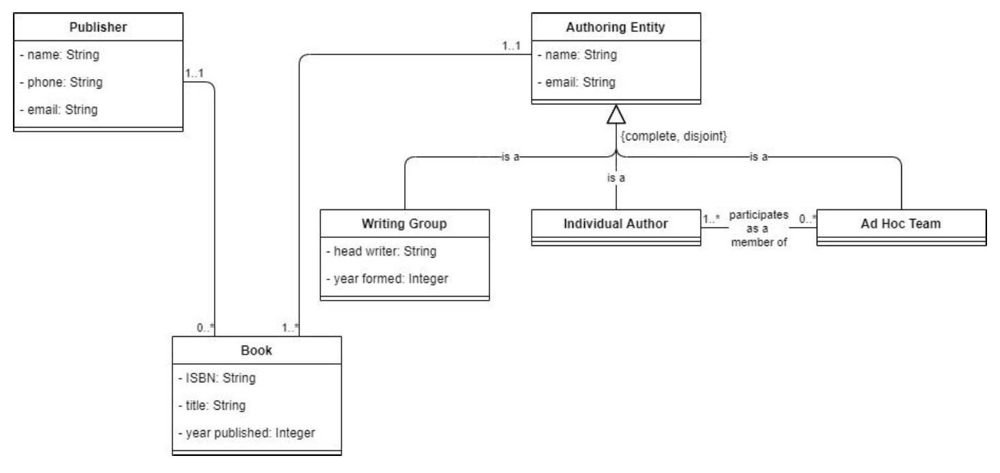

# CECS 323 Project 1
JPA - BOOKS

## Table of Contents
- [Objective](#Objective)
- [Introduction](#Introduction)
- [UML](#UML)
- [DDL](#DDL)
- [Authors](#Authors)

## Objective
Get an introduction to coding in Java Persistence API (JPA) using a small number of common JPA constructs.

## Introduction
JPA has annotations for every mapping of the object model to the relational model. Many of those annotations are just variations on a theme, and therefore easy to pick up and intuitive once you have some experience with JPA. Others are more distinctive and take longer to master. But overall, we do not have anywhere near enough time to devote to JPA that we would need if we were going to get a broad understanding of everything that it does. Instead, this project will concentrate on just a few of the constructs in JPA as a demonstration of the overall process for mapping from the OO model to the relational.

Frequently, you will be asked to start with an existing database and either update an existing application that accesses that database, or write a new, OO application to access the existing database. Starting a project from scratch is rare in a mature environment. In this project, I will give you DDL to create the tables that you need [here](#DDL). **Do not modify the table structure in any way** in your project.

Your job is to write the Java entities (annotated POJOs) for all the classes in this model:
## UML


## DDL
```sql
CREATE TABLE AUTHORING_ENTITIES
(
    EMAIL VARCHAR(30) NOT NULL PRIMARY KEY,
    AUTHORING_ENTITY_TYPE VARCHAR(31),
    NAME VARCHAR(80) not null,
    HEAD_WRITER VARCHAR(80),
    YEAR_FORMED INTEGER
)

create table AD_HOC_TEAMS_MEMBER
(
    INDIVIDUAL_AUTHORS_EMAIL VARCHAR(30) not null
        constraint DHCTMSMNDVDLTHRSML
            references AUTHORING_ENTITIES,
    AD_HOC_TEAMS_EMAIL VARCHAR(30) not null
        constraint DHCTMSMMBRDHCTMSML
            references AUTHORING_ENTITIES,
    primary key (INDIVIDUAL_AUTHORS_EMAIL, AD_HOC_TEAMS_EMAIL)
);

create table PUBLISHERS
(
    NAME VARCHAR(80) not null primary key,
    EMAIL VARCHAR(80) not null unique,
    PHONE VARCHAR(24) not null unique
);

create table BOOKS
(
    ISBN VARCHAR(17) not null primary key,
    TITLE VARCHAR(80) not null,
    YEAR_PUBLISHED INTEGER not null,
    AUTHORING_ENTITY_NAME VARCHAR(30) constraint BKSTHRNGENTITYNAME
            references AUTHORING_ENTITIES,
    PUBLISHER_NAME VARCHAR(80) constraint BOOKSPUBLISHERNAME
            references PUBLISHERS,
    unique (TITLE, PUBLISHER_NAME),
    unique (TITLE, AUTHORING_ENTITY_NAME)
);
```

## Authors
* **Nathaniel Ventura** - https://github.com/nateV-2112
* **Malhar Pandya** - https://github.com/MPandya0
* **Tony Samaniego** - https://github.com/tmsoc


